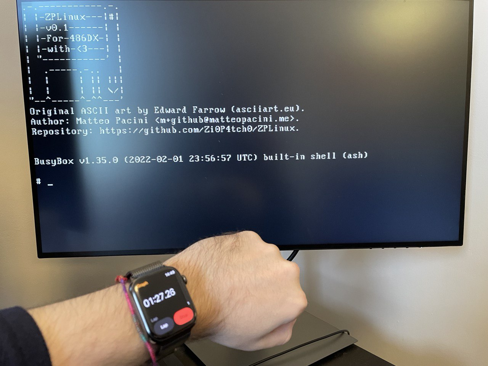
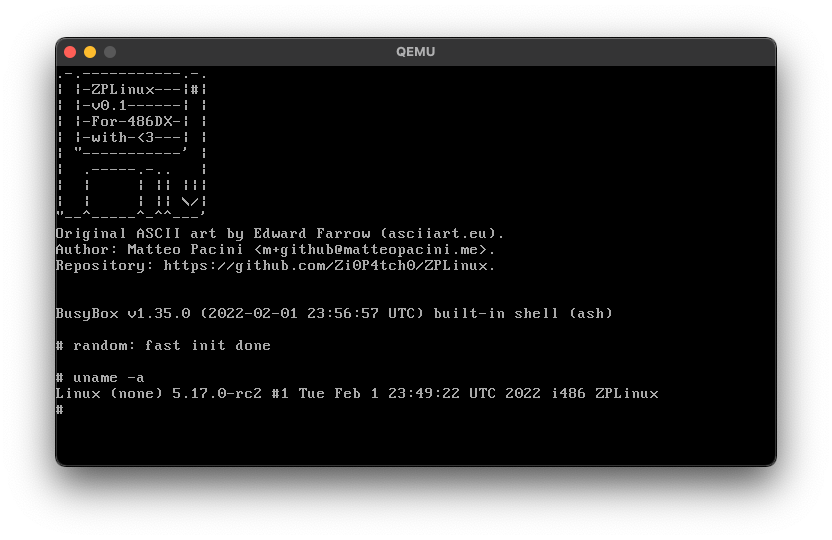
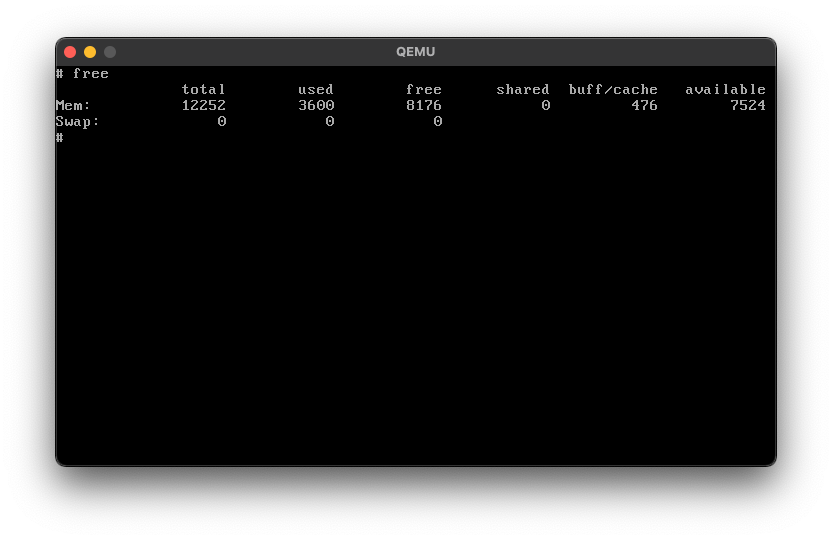
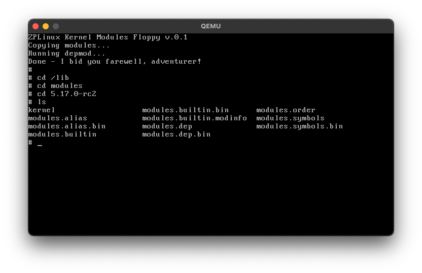
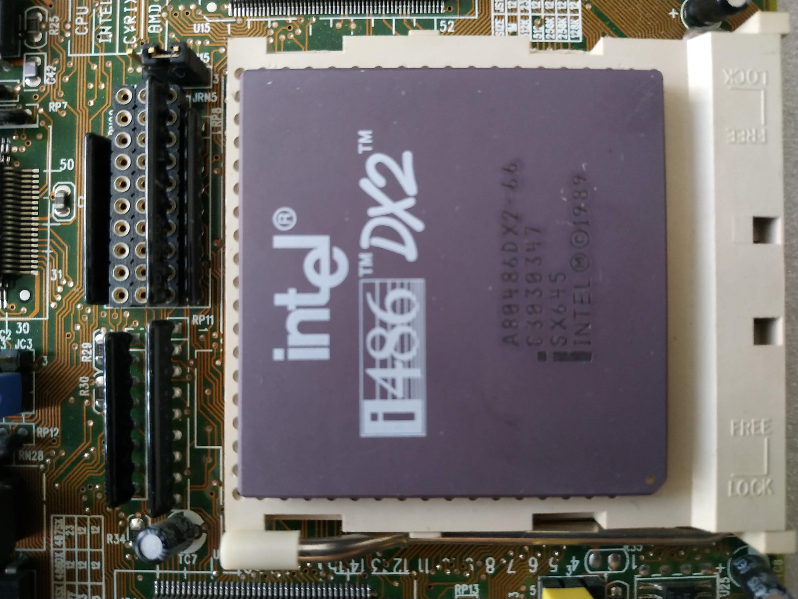
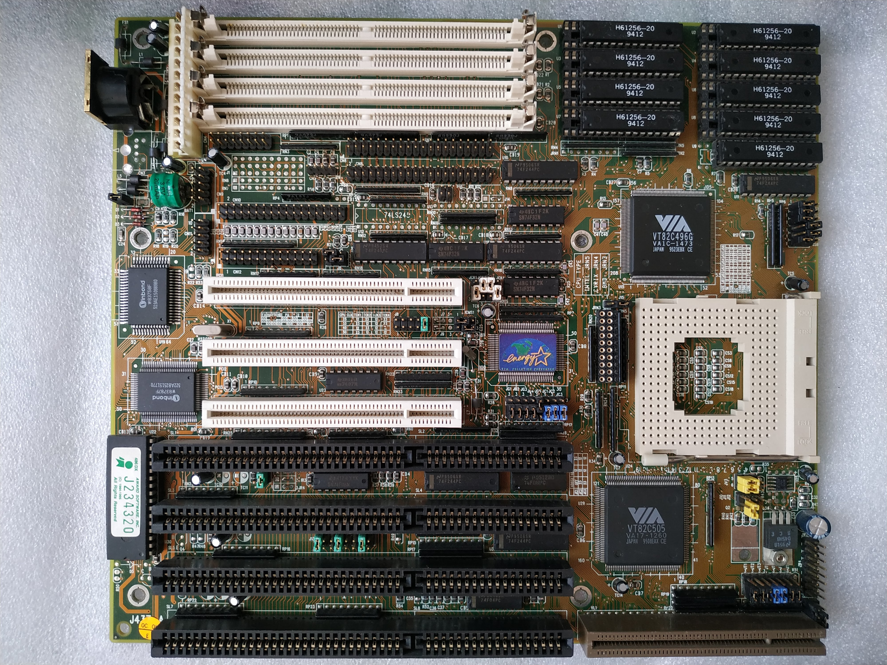
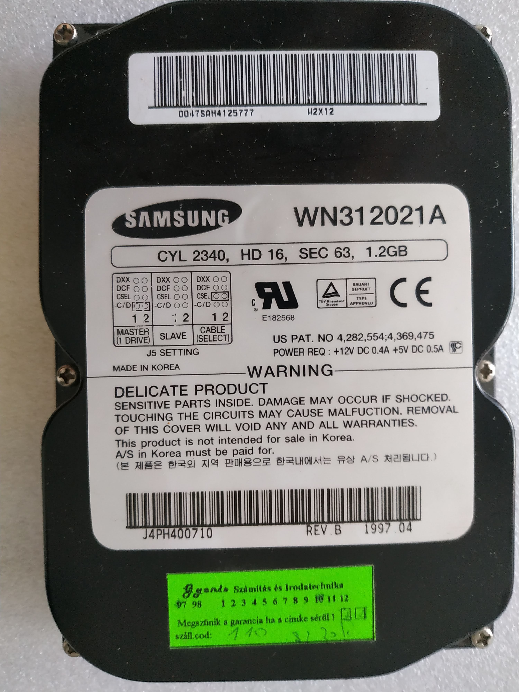
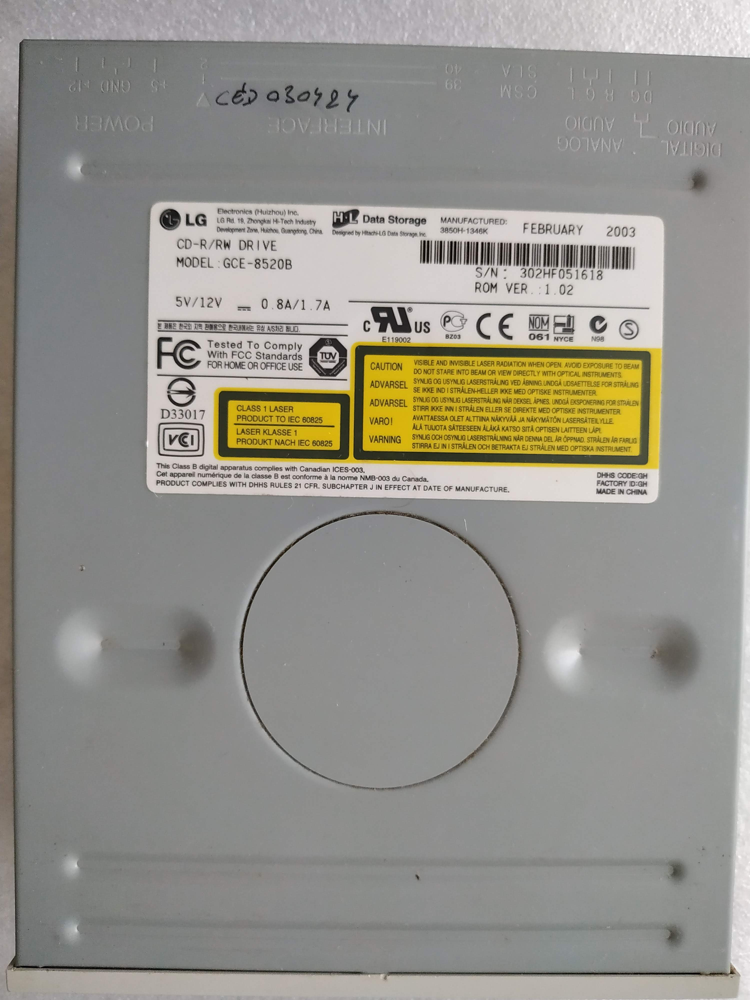
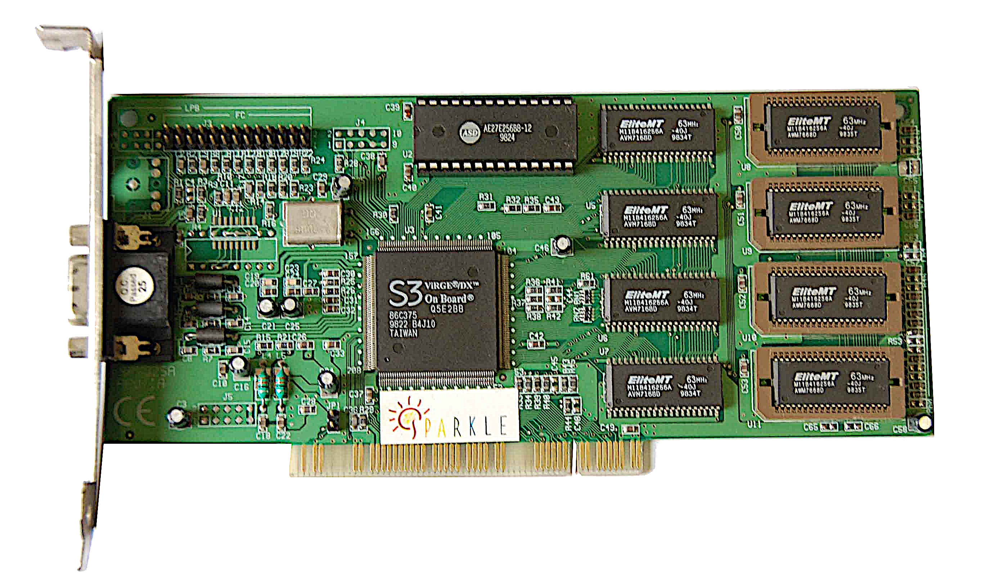
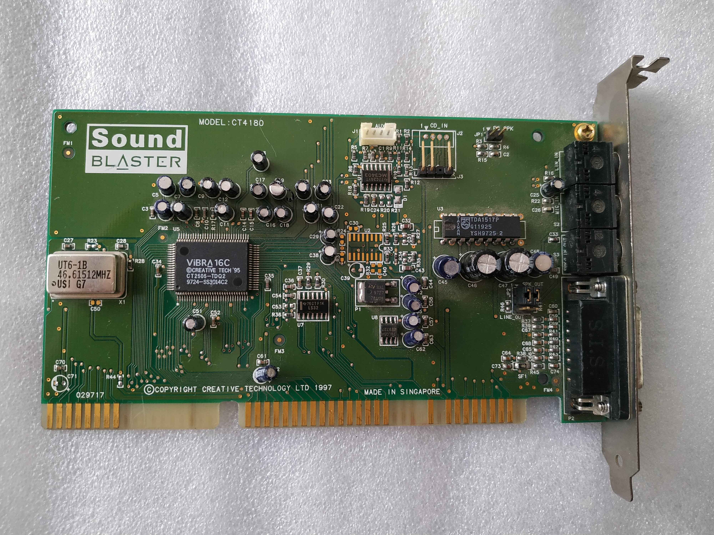

# ZPLinux


    
A tailored Linux release for my 486 FreeDOS machine.

(Toolchain and distro built with Docker)

(Yeah, that's [cmatrix](https://github.com/abishekvashok/cmatrix) burning the 66Mhz CPU)

Comes in two lovely floppy diskettes.


---

## Changelog

**v0.1**

- Initial Release

**v0.2**

- Added `Real Time Clock` support in the kernel.
- Safer toolchain (without `LDFLAGS="-s"`) / binaries and `.so` are now stripped via` *strip --strip-unneeded` at the end of toolchain build process.
- Removed most of built static libraries - going fully dynamic whenever applicable.
- Copied libc.so to the modules floppy - the script now creates the symlinks for the interpreter `/lib/ld-musl-i386.so.1` and `/bin/ldd`.
- Non-boot diskettes are now `ext2` formatted.

**v0.3**

- Ported toolchain and build system to Nix (rest TBW)

---

## Target Machine

- **Motherboard**: Jetway-437 (VESA, PCI)
- **CPU**: Intel 486 DX2 - 66Mhz
- **RAM**: 4x4MB EDO RAM (16MB)
- **VGA**: S3 Virge/DX 4MB
- **Sound**: Creative SB16 Vibra PnP (ISA)
- **Network**: RTL8029AS
- **HDD**: Samsung WN312021A (1,2GB)
- **CD-ROM**: LG GCR-8520b
- **Floppy**: 3.5” 1.44MB
- **Keyboard**: DYN5 UK Keyboard
- **Mouse**: Microsoft Serial Mouse (2 buttons)


---

## Screenshots & Videos

Boot time from when the floppy is triggered to usable shell (around 1m27s).


Full cold-boot video

https://user-images.githubusercontent.com/3139724/152242129-2d1fa038-bad1-4fbe-9fbb-e9b857d943e8.mov

---

## More Screenshots (QEMU)







---

## Kernel Configuration

Modules are a must - it's impossibile to fit everything into a floppy. The non-essential modules will be offloaded to the second floppy.

    - Enable loadable module support
    - Enable block layer
    - General setup -> swap 
    - General setup -> initramfs/initrd support (gzip only)

Some generic must-have features  

    - General setup -> Kernel Features (expert) -> printk
    - General setup -> Kernel Features (expert) -> PC-Speaker
    - Executable file formats -> ELF binaries
    - Executable file formats -> Scripts starting with #!
    - Device drivers -> Generic driver options -> devtmpfs

Processor configuration



    - Processor -> Family -> 486DX
    - Processor -> Load address -> 0x400000

The motherboard supports both ISA and PCI, so...




    - Bus -> ISA support
    - Device drivers -> PCI support

For the block devices, the machine uses SCSI/PATA.




    - Device drivers -> Block devices -> Normal floppy support
    - Device drivers -> SCSI -> SCSI device support
    - Device drivers -> SCSI -> SCSI disk support
    - Device drivers -> SCSI -> SCSI CDROM
    - Device drivers -> SATA/PATA -> ATA SFF support
    - Device drivers -> SATA/PATA -> Generic platform device PATA support
    - Device drivers -> SATA/PATA -> Legacy ISA PATA support

For the VGA (module)




    - Device drivers -> Graphics -> Framebuffer support -> S3 Trio/Virge 

Filesystems (ext2, fat, vfat and ISO9660)

    - File systems -> EXT2                  
    - File systems -> CDROM -> ISO9660                  
    - File systems -> DOS/VFAT/etc -> MSDOS                  
    - File systems -> DOS/VFAT/etc -> VFAT                  
    - File systems -> Pseudo -> /proc                  
    - File systems -> Pseudo -> sysfs                  
    - File systems -> NLS -> Codepage 437                  
    - File systems -> NLS -> ISO 8859-1  

Mouse (module) and keyboard

    - Device drivers -> Input device support -> Keyboards -> AT
    - Device drivers -> Input device support -> Mice -> Serial 

Sound card (Vibra16 - ISA PnP)



    - Device drivers -> PNP support -> ISA PNP   
    - Device drivers -> Sound card support -> ISA devices -> SB16 PnP    

Parallel port (module)

    - Device drivers -> Parallel port support -> PC-Style hardware  

PC speaker (module)

    - Device drivers -> Input device support -> Miscellaneous -> PC Speaker  

 TTY

    - Device drivers -> Character devices -> TTY
    - Device drivers -> Character devices -> TTY / Output messages to printk

---

## Busybox settings

TBW

## Running

```bash
nix run github:matteo-pacini/zplinux
```

Note: compilation of the cross-toolchain may take a while.

## Must Read

Articles that inspired my Linux quest:

- [Floppinux - An Embedded 🐧Linux on a Single 💾Floppy](https://bits.p1x.in/floppinux-an-embedded-linux-on-a-single-floppy/) by Krzysztof Krystian Jankowski
- [Linux on a 486SX](https://ocawesome101.github.io/486-linux.html) by Ocawesome101

