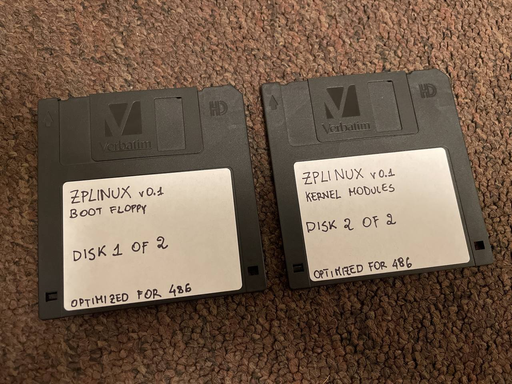
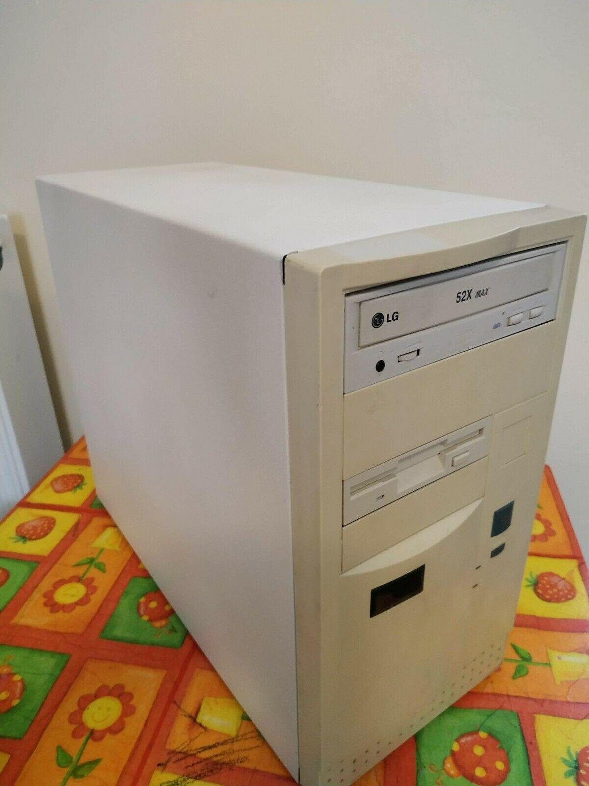

# ZPLinux

    
A tailored Linux release for my 486 FreeDOS machine.

(Yeah, that's [cmatrix](https://github.com/abishekvashok/cmatrix) burning the CPU)

Comes in two lovely floppy diskettes.

---

## Target Machine

- Motherboard: Jetway-437 (VESA, PCI)
- CPU: Intel 486 DX2 - 66Mhz
- RAM: 4x4MB EDO RAM (16MB)
- VGA: S3 Virge/DX 4MB
- Sound: Creative SB16 Vibra PnP (ISA)
- Network: RTL8029AS
- HDD: Samsung WN312021A (1,2GB)
- CD-ROM: LG GCR-8520b
- Floppy: 3.5” 1.44MB
- Keyboard: DYN5 UK Keyboard
- Mouse: Microsoft Serial Mouse (2 buttons)

---

## Build machine

- Macbook Pro M1 Max 64GB (10 core)

---

## Ideas & Solutions

- I want a modern kernel built with a modern toolchain
    - SOLUTION: **Build a bespoke i486 toolchain, and build the kernel with it**
- Glibc creates massive binaries and binary size is a top concern here
    - SOLUTION: **use musl instead of glibc**
- Cross-compiling on macOS is painful:
    - Filesystem issues (e.g. filesystem not being case-sensitive by default)
    - GNU tools don't always behave correctly
    - M1 is based on ARM - a few tools may not run at all (e.g. syslinux)
    - I don't want to pollute the filesystem of my Macbook.
    - SOLUTION: **Use Docker**

---

## Kernel Configuration

TBW

### All configuration items

- Enable loadable module support
- Enable block layer
- General setup -> swap 
- General setup -> initramfs/initrd support (gzip only)
- General setup -> Kernel Features (expert) -> printk
- General setup -> Kernel Features (expert) -> PC-Speaker
- Processor -> Family -> 486DX
- Processor -> Load address -> 0x400000
- Bus -> ISA support
- Executable file formats -> ELF binaries
- Executable file formats -> Scripts starting with #!
- Device drivers -> PCI support
- Device drivers -> Generic driver options -> devtmpfs
- **(MODULE)** Device drivers -> Parallel port support                                 
- **(MODULE)** Device drivers -> Parallel port support -> PC-Style hardware          
- Device drivers -> PNP support -> ISA PNP
- Device drivers -> Block devices -> Normal floppy support
- Device drivers -> SCSI -> SCSI device support
- Device drivers -> SCSI -> SCSI disk support
- Device drivers -> SCSI -> SCSI CDROM
- Device drivers -> SATA/PATA
- Device drivers -> SATA/PATA -> ATA SFF support
- Device drivers -> SATA/PATA -> Generic platform device PATA support
- Device drivers -> SATA/PATA -> Legacy ISA PATA support
- Device drivers -> SATA/PATA -> Legacy ISA PATA support
- Device drivers -> Input device support
- Device drivers -> Input device support -> Generic input layer
- Device drivers -> Input device support -> Keyboards
- Device drivers -> Input device support -> Keyboards -> AT
- Device drivers -> Input device support -> Mice
- **(MODULE)** Device drivers -> Input device support -> Mice -> Serial                
- Device drivers -> Input device support -> Miscellaneous 
- **(MODULE)** Device drivers -> Input device support -> Miscellaneous -> PC Speaker  
- Device drivers -> Character devices -> TTY
- Device drivers -> Character devices -> TTY / Output messages to printk
- **(MODULE)** Device drivers -> Graphics -> Framebuffer support                       
- **(MODULE)** Device drivers -> Graphics -> Framebuffer support -> S3 Trio/Virge      
- **(MODULE)** Device drivers -> Sound card support                                    
- **(MODULE)** Device drivers -> Sound card support -> ALSA                            
- Device drivers -> Sound card support -> ISA devices                       
- **(MODULE)** Device drivers -> Sound card support -> ISA devices -> SB16 PnP        
- File systems -> EXT2                  
- File systems -> CDROM -> ISO9660                  
- File systems -> DOS/VFAT/etc -> MSDOS                  
- File systems -> DOS/VFAT/etc -> VFAT                  
- File systems -> Pseudo -> /proc                  
- File systems -> Pseudo -> sysfs                  
- File systems -> NLS -> Codepage 437                  
- File systems -> NLS -> ISO 8859-1  

---

## Busybox settings

TBW

### All configuration items

- Settings -> Files > 2GB
- Settings -> Build static binary
- Settings -> CFLAGS -> -Os -g0 -march=i486 -mcpu=i486 -mtune=i486
- Settings -> CFLAGS (continued) -> -D_FILE_OFFSET_BITS=64 -D_TIME_BITS=64
- Settings -> LDFLAGS -> -s
- Settings -> Coreutils:
    - cat 
  * cp 
  * echo
  * cat 
  * ln
  * ls 
  * mkdir 
  * mv 
  * rm 
  * sleep 
  * sync 
  * uname (ZPLinux) 
- Console utilites -> clear
- Editors -> vi
- Finding utilities -> find
- Linux Ext2 FS Progs -> fsck
- Linux modules ->  all but modinfo
- Linux sysutils ->  disk
- Linux sysutils ->  lspci
- Linux sysutils ->  mdev
- Linux sysutils ->  mkfs.ext2, msdosfs, mkfs.vfat, mkswap
- Linux sysutils -> mount, swapon, swapoff, umount
- Misc -> lsscsi
- Process utilities -> free
- Shells -> ash (optimize for size, alias support)

---

## Docker images

### Provided files

- `busybox-config` and `kernel-config` are self-explanatory.
- `busybox-init` is the main initramfs script.
- `entrypoint.sh` is the entrypoint script for the `zplinux` image that builds kernel and busybox, and also creates the floppies.
- `floppy.img` is a dump of a physical floppy diskette, formatted under FreeDOS 1.3RC5 and with Syslinux 4.x installed on it

---

### 486toolchain

This image builds a `i486-linux-musl-*` prefixed cross-compiler toolchain in `/toolchain`.

Only the `build-essential` package is kept installed at the end of the building process.

It is the base image for the `zplinux` one.

It also includes ncurses and zlib.

---

### zplinux

This image compiles and packages the kernel and busybox at build time.

The floppy disk(s) are created at runtime by the entrypoint script.

---

## Running

    # Build toolchain image
    docker build -t 486toolchain ./486toolchain 
    # Build zplinux image
     docker build -t zplinux ./zplinux
    # Finalise zplinux build 
    docker run --rm -ti -v /some/output/folder:/data --privileged zplinux

    # Once the floppy is built, copy it to /data
    docker-machine> cp /floppies/zplinux.img /data
    docker-machine> exit

    # Flash it (or test it in QEMU - see below)
    sudo dd if=/path/to/zplinux.img of=DEVICE bs=512 count=2880 conv=noerror,sync

## QEMU

    qemu-system-i386 -cpu 486 -m 16 -fda zplinux.img

## Must Read

Articles that inspired my Linux quest:

- [Floppinux - An Embedded 🐧Linux on a Single 💾Floppy](https://bits.p1x.in/floppinux-an-embedded-linux-on-a-single-floppy/) by Krzysztof Krystian Jankowski
- [Linux on a 486SX](https://ocawesome101.github.io/486-linux.html) by Ocawesome101

